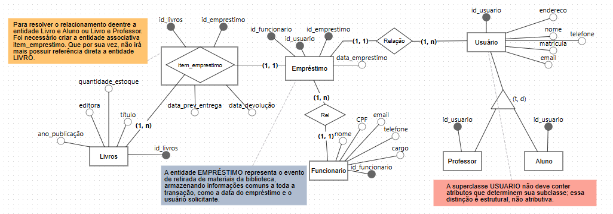
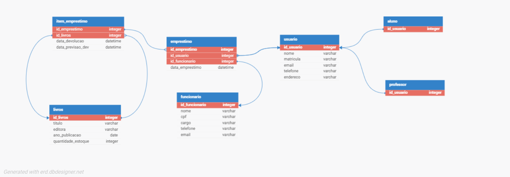

# 📚 Projeto Biblioteca - Modelagem de Dados e ORM com SQLAlchemy


## 📌 Visão Geral

Este projeto consiste no desenvolvimento de um **Sistema de Gerenciamento de Biblioteca**, com foco na modelagem, organização e validação da camada de dados.

A proposta aplica conceitos de **MER** e **DER** para representar corretamente as regras de negócio, evoluindo para uma implementação com **SQLAlchemy ORM**, **SQLite**, testes manuais, testes automatizados com `pytest`, logs de execução e preparação da base para uma futura API com Flask.

O sistema contempla entidades como usuários, alunos, professores, livros, empréstimos e itens de empréstimo, incluindo herança (generalização/especialização) e relacionamentos complexos, alinhados a um DER consistente.

---

## 🎯 Objetivos do Projeto

## Objetivos do Projeto

- Aplicar conceitos de modelagem conceitual, lógica e física;
- Implementar ORM com SQLAlchemy;
- Representar herança, generalização e especialização;
- Garantir integridade referencial entre entidades;
- Validar os models com testes manuais e automatizados;
- Preparar o projeto para evolução com API e interface web;
- Organizar o código de forma modular, escalável e profissional.

---

## Diferenciais em Relação a Projetos Anteriores

Este projeto apresenta avanços significativos em relação a implementações anteriores:

### 1. Separação entre código e exploração:

Diferente de projetos anteriores, **o Jupyter Notebook não é usado para criar ou definir tabelas**.  
Ele é utilizado apenas para:
- Documentar decisões de modelagem
- Explorar o mapeamento ORM
- Testar comportamentos e relacionamentos

A definição oficial do banco fica exclusivamente no código Python (`src/`).

---

### 2. Uso consciente do Jupyter Notebook:

O Jupyter é utilizado como:
- Ferramenta de **aprendizado**
- Ambiente de **validação do ORM**
- Suporte à **documentação viva do projeto**

Isso evita:
- Redefinições acidentais de tabelas
- Conflitos de metadata
- Erros comuns em ambientes interativos

---

### 3. Estrutura de projeto profissional
O projeto segue uma organização clara:

- `src/` → códigos de domínio e persistência do bando de dados
- `notebooks/` → modelagem e testes exploratórios (módulo adicional)
- `requirements.txt` → dependências utilizadas
- `README.md` → documentação central

Essa separação facilita:
- Manutenção
- Evolução do sistema
- Migração futura para frameworks web (FastAPI, Django, etc.)

---

## 🔄 Por que o DuckDB foi substituído?

Inicialmente, o projeto utilizou **DuckDB**, porém a escolha foi revista por razões técnicas.

### DuckDB: excelente para análise:

O DuckDB é um banco:
- Colunar
- Extremamente eficiente para **análises analíticas (OLAP)**
- Ideal para ciência de dados e workloads de leitura

Entretanto:

Possui **suporte limitado a restrições relacionais**, como:

- Chaves estrangeiras
- Constraints complexas
- Regras de integridade referencial

Essas limitações impactam diretamente projetos **transacionais (OLTP)**, como sistemas de biblioteca.

---

### 🟢 SQLite: mais adequado ao contexto do projeto

O SQLite foi adotado por ser:

- Um **banco relacional completo**
- Forte em **restrições e integridade**
- Totalmente compatível com SQLAlchemy ORM
- Simples para desenvolvimento local e acadêmico

Para um sistema de biblioteca, onde:

- integridade dos dados é crítica
- relações entre tabelas são fundamentais

O SQLite se mostra **mais apropriado que o DuckDB**.

---

## Diagramas do Projeto

A modelagem do sistema foi documentada por meio de diagramas conceitual e lógico, representando as principais entidades, atributos e relacionamentos do domínio de biblioteca.

### Modelo Conceitual - Peter Chen

O modelo conceitual apresenta a visão de alto nível do domínio, destacando as entidades principais e os relacionamentos entre elas.



### Modelo Lógico - James Martin

O modelo lógico detalha a estrutura relacional do sistema, aproximando a modelagem da implementação física no banco de dados.



## Evolução do Projeto:

O projeto evoluiu em etapas:

1. Modelagem conceitual e lógica com apoio de notebooks;
2. Implementação dos models ORM com SQLAlchemy;
3. Criação do banco oficial `project_biblioteca.db`;
4. Validação da conexão e dos CRUDs principais;
5. Criação de testes automatizados com `pytest`;
6. Configuração de logs de execução;
7. Integração inicial com Flask, Flask-SQLAlchemy e Flask-Migrate;
8. Preparação para versionamento do banco com Alembic.

---

## Execução:

Abra o terminal na pasta project_biblioteca_2 e rode:

`python -m create_db`


## Banco de Dados:

O banco oficial do projeto é:

```text
project_biblioteca.db
```

## 🧠 Tecnologias Utilizadas

- Python 3.11+
- SQLAlchemy ORM
- SQLite
- Pytest
- Logging
- Flask
- Flask-SQLAlchemy
- Flask-Migrate
- Alembic
- Jupyter Notebook
- Conda / Ambiente virtual
- Git e GitHub

---

*O banco biblioteca.db, criado durante explorações em notebooks, foi mantido como legado e não é utilizado na etapa modular atual.*

## 📂 Estrutura do projeto legado:

```
project_biblioteca/
│
├── notebooks/
│   ├── 01_biblioteca.ipynb
│   ├── 02_modelagens.ipynb
│   └── 03_testes_orm.ipynb
│
├── src/
│   ├── database/
│   │   ├── __init__.py
│   │   ├── base.py
│   │   └── connection.py
│   │
│   ├── models/
│   │   ├── __init__.py
│   │   ├── usuario.py
│   │   ├── aluno.py
│   │   ├── professor.py
│   │   ├── livro.py
│   │   ├── emprestimo.py
│   │   └── item_emprestimo.py
│   │   └── funcionario.py
│   │
│   └── __init__.py
│   └── create_db.py
│   └── model_data_concept_peter_chen.py
│   └── model_data_lofic_james_martin.py
├── .gitignore
├── requirements.txt
└── README.md
```
## 📂 Estrutura atual do Projeto:

```
project_biblioteca_2/
│
├── notebooks/
│   ├── 01_biblioteca.ipynb
│   ├── 02_modelagens.ipynb
│   └── 03_testes_ORM.ipynb
│
├── src/
│   ├── database/
│   │   ├── base.py
│   │   └── connection.py
│   │
│   ├── models/
│   │   ├── usuario.py
│   │   ├── livro.py
│   │   ├── funcionario.py
│   │   ├── emprestimo.py
│   │   └── item_emprestimo.py
│   │
│   ├── app.py
│   ├── config.py
│   ├── extensions.py
│   └── create_db.py
│
├── tests/
│   ├── manuais/
│   └── automatizados/
│
├── migrations/
├── logs/
├── wsgi.py
├── pytest.ini
├── requirements.txt
├── LICENSE
└── README.md
```

## Testes:

O projeto possui testes manuais e automatizados.

```
tests/
├── manuais/
│   ├── test_conexao.py
│   ├── crud_test.py
│   └── crud_emprestimo_test.py
│
└── automatizados/
    ├── conftest.py
    └── test_crud_models.py
```

Os testes validam:

- conexão com o banco;
- CRUD de Livro;
- CRUD de Usuario;
- CRUD de Funcionario;
- criação de Emprestimo com ItemEmprestimo;
- relacionamentos entre as entidades;
- criação das tabelas em banco SQLite em memória.

### Para executar:

```
pytest
```

## Flask & Migrations:

> A base Flask foi adicionada para preparar o projeto para a futura API.

**Foram configurados:**

- Flask;
- Flask-SQLAlchemy;
- Flask-Migrate;
- Alembic;
- rota inicial /initial;
- reaproveitamento da Base.metadata dos models existentes.

### A aplicação pode ser inspecionada com:

```
flask --app wsgi:app routes
```

### A estrutura de migrations foi inicializada com:

```
flask --app wsgi:app db init
```

> Mais detalhes técnicos dessa etapa estão documentados em:

```
src/README.md
```

### Status Atual:

A camada ORM já foi validada com testes manuais e automatizados. A base Flask e o controle inicial de migrations também foram preparados.

A próxima etapa será a construção da API, começando pelos endpoints.

### Próximos Passos:

- Criar endpoints 
- Expandir API 
- Criar camada de serviços;
- Adicionar testes para a API;
- Evoluir para interface web.


## 👤 Autor do Projeto:

**Daniel Martins França**

*Projeto desenvolvido com foco em modelagem de dados, bancos de dados relacionais, ORM, testes e evolução para aplicações web.*

## 📬 Contato:

- 📧 Email: [f.daniel.m@gmail.com](mailto:f.daniel.m@gmail.com)  
- 💼 LinkedIn: [www.linkedin.com/in/danixdev](https://www.linkedin.com/in/danixdev)  
- 📁 Trabalhos: [wwww.danixdev.blogspot.com/2026/01/projeto-de-banco-de-dados-para.html](https://danixdev.blogspot.com/2026/01/estruturacao-de-banco-de-dados-para.html)

