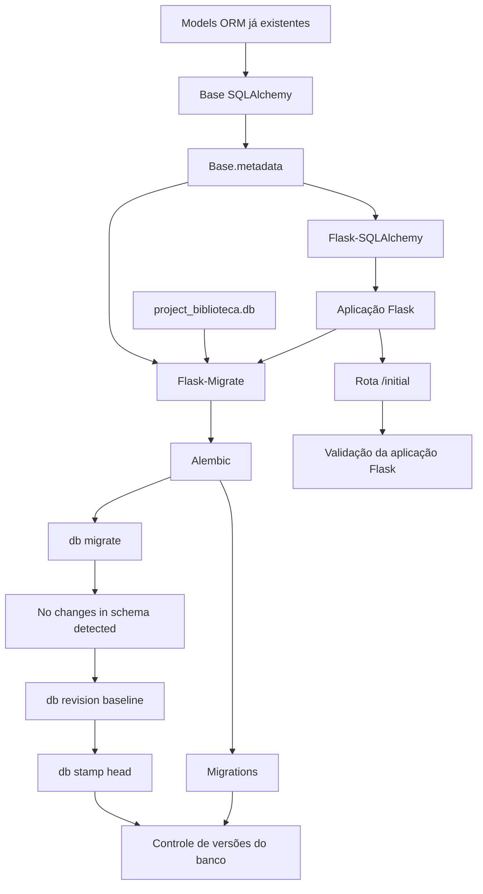

# 🚀 Atualização: Integração com Flask, Flask-SQLAlchemy e Flask-Migrate

Nesta etapa, o projeto Biblioteca evoluiu da validação da camada ORM para a preparação da base da futura API.

A decisão principal foi manter os models já existentes, que herdam da `Base` do SQLAlchemy, e conectá-los ao Flask-SQLAlchemy sem reescrever a estrutura atual.

###  ✅ Principais Atualizações:

- Criação da estrutura inicial Flask
- Configuração do Flask-SQLAlchemy
- Integração com a `Base.metadata` existente
- Configuração do Flask-Migrate com Alembic
- Definição do banco oficial como `project_biblioteca.db`
- Criação de uma rota inicial de verificação (`/initial`)
- Inicialização da estrutura de migrations
- Criação de baseline para controle futuro do banco

### 📁 Arquivos Criados:

```text
src/config.py
src/extensions.py
src/app.py
wsgi.py
migrations/
```

### 🧩 Flask-SQLAlchemy:

A integração foi feita reaproveitando a **Base** já usada pelos **models** legados em ```src/```
Essa abordagem preserva a modelagem já validada com testes automatizados.

### 🏭  Application Factory:

Foi criada a função create_app() para inicializar a aplicação Flask.
Dessa forma a estrutura facilita a evolução futura do projeto, permitindo adicionar rotas, blueprints, configurações e testes da API de forma organizada.

### 🌐 WSGI

WSGI significa **Web Server Gateway Interface**.

Ele é um padrão do ecossistema Python que define como um servidor web conversa com uma aplicação Python. No caso deste projeto, o Flask cria uma aplicação compatível com WSGI, e o arquivo `wsgi.py` expõe essa aplicação para que o Flask CLI, servidores WSGI ou ferramentas externas consigam carregá-la.

No projeto, o arquivo `wsgi.py` ficou responsável por criar a aplicação Flask:

```python
from src.app import create_app

app = create_app()
```

Esse arquivo permite executar comandos Flask com:

```flask --app wsgi:app routes```

### 🩺 Rota 'initial':

> Essa rota serve para validar rapidamente se a aplicação Flask está carregando corretamente.

### 🧬 Migrations com Alembic

A estrutura de migrations foi inicializada com:

```
flask --app wsgi:app db init
```

> Isso criou a pasta **migrations/** 


### 🔎  Logo em seguida foi feita a verificação do schema:

```flask --app wsgi:app db migrate -m "baseline schema"```

O Alembic indicou que não havia mudanças no schema: ```No changes in schema detected.```

> Isso confirmou que o banco atual estava alinhado com os models existentes.

### 🧱 Baseline:

```
Como o banco já existia e estava alinhado aos models, foi criada uma baseline para que o Alembic passe a controlar as próximas alterações do schema.
```

### 🛠️ Comandos utilizados:

```
flask --app wsgi:app db revision -m "baseline schema"
flask --app wsgi:app db stamp head
```

> A partir desse ponto, futuras alterações nos models poderão gerar migrations versionadas.


### 📌 Status Atual:

A aplicação agora possui:

- Base Flask configurada
- Flask-SQLAlchemy conectado à metadata existente
- Flask-Migrate configurado
- Alembic inicializado
- Banco oficial definido
- Rota /initial
- Baseline de migrations criada
- Estrutura preparada para iniciar a API

### 🔄 Fluxo de Integração: Models ORM, Flask-SQLAlchemy e Migrations



*Esse padrão também prepara o projeto para execução futura em servidores como Gunicorn, Waitress, uWSGI ou plataformas de hospedagem. Em desenvolvimento, o Flask consegue rodar a aplicação diretamente. Em produção, a própria documentação do Flask recomenda usar um servidor WSGI dedicado, pois o servidor de desenvolvimento não foi criado para ser usado publicamente.*

## Documentação oficial:

- PEP 3333 — Python Web Server Gateway Interface v1.0.1
- Flask Docs — Deploying to Production
- Flask Docs — Application Factories